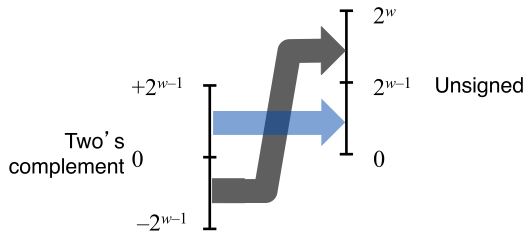
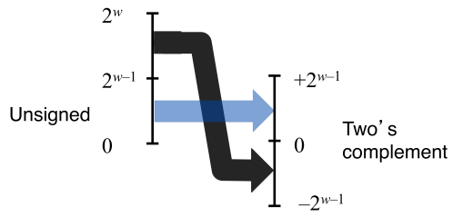
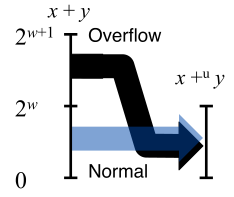
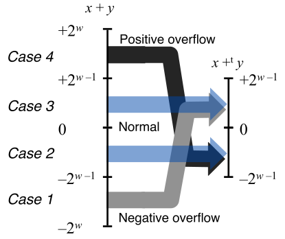
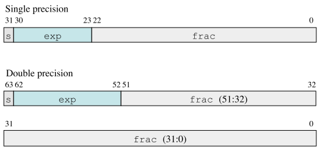

### 十进制转十六进制

将一个十进制数字`x`转换为十六进制，可以反复用`x`除以 16，得到商`q`和余数`r`，即`x=q*16+r`。然后用十六进制数字表示的`r`作为最低位数字，并通过对`q`反复进行这个过程得到剩下的数字。

**例题** 将十进制 314156 转换十六进制

> ```
> 314156  =   19634 * 16 + 12 (C)
> 19634   =   1227 * 16 + 2   (2)
> 1227    =   76 * 16 + 11    (B)
> 76      =   4 * 16 + 12     (C)
> 4       =   0 * 16 + 4      (4)
> ```
>
> 十六进制表示为 0x4cb2c。

## 字数据

我们将程序称为“32 位程序”或者“64 位程序”时，区别在于**该程序是如何编译的，而不是其运行的机器类型。**`linux> gcc -m32 prog.c`该程序可以在 32 位或 64 位机器上正确运行。另一方面，`linux> gcc -m64 prog.c`只能在 64 位机器运行。

### 基本 C 数据类型的典型大小

| 有符号        | 无符号         | 32 位 | 64 位 |
| ------------- | -------------- | :---: | :---: |
| [signed] char | unsigned char  |   1   |   1   |
| short         | unsigned short |   2   |   2   |
| int           | unsigned       |   4   |   4   |
| long          | unsigned long  |   4   |   8   |
| int32_t       | uint32_t       |   4   |   4   |
| int64_t       | uint64_t       |   8   |   8   |
| char \*       |                |   4   |   8   |
| float         |                |   4   |   4   |
| double        |                |   8   |   8   |

为了避免由于依赖“典型”大小和不同编译器设置带来的奇怪行为，ISO C99 引入来一类数据类型（`int32_t`和`int64_t`），其数据大小是固定的，不随编译器和机器设置而变化。使用确定大小的整数类型是程序员准确控制数据表示的最佳途径。

### 大小端

考虑一个`w`位的整数`x`，其位表示为，其中是最高有效位，是最低有效位。最低有效位所处的字节称为最低有效字节，最高有效位所处的字节称为最高有效字节。

某些机器选择在内存中按照从最高有效字节到最低有效字节的顺序存储对象，称为大端法（big endian），而另一些机器按照从最低有效字节到最高有效字节的顺序存储对象，称为小端法（little endian）。

**例题** 假设变量`x`的类型为 int，位于地址 0x100 处，十六进制为 0x01234567。

> **大端法**
>
> |     | 0x100 | 0x101 | 0x102 | 0x103 |     |
> | :-: | :---: | :---: | :---: | :---: | :-: |
> | ... |  01   |  23   |  45   |  67   | ... |
>
> **小端法**
>
> |     | 0x100 | 0x101 | 0x102 | 0x103 |     |
> | :-: | :---: | :---: | :---: | :---: | :-: |
> | ... |  67   |  45   |  23   |  01   | ... |

**需要重视字节顺序的情形：**

1. 在不同类型的机器之间通过网络传输二进制数据时
2. 当阅读表示整数数据的字节序列时
3. 当编写规避正常的类型系统的程序时

```C
typedef unsigned char *byte_pointer;

void show_bytes(byte_pointer start, size_t len) {
    size_t i;
    for (i = 0; i < len; i++)
	printf(" %.2x", start[i]);    //line:data:show_bytes_printf
    printf("\n");
}
```

_[code. 使用强制类型转换来规避类型系统，打印程序对象的字节]_

## C 语言运算

### 位级运算

C 语言支持按位布尔运算。

- 与 And：`A=1` 且 `B=1` 时，`A&B=1`
- 或 Or：`A=1` 或 `B=1` 时，`A|B=1`
- 非 Not：`A=1` 时，`~A=0`；`A=0` 时，`~A=1`
- 异或 Exclusive-Or(Xor)：`A!=B` 时，`A^B=1`；`A=B` 时，`A^B=0`

位级运算常见用法就是实现**掩码**运算。

**练习题 2.12** 对于下面的值，写出变量`x`的 C 语言表达式。你的代码应该对任何字长`w>=8`都能工作。给出`x=0x87654321`以及`w=32`时表达式的求值结果，以供参考。

- `x`的最低有效字节，其他位均置为 0。_[0x00000021]_
- 除了`x`的最低有效字节外， 其他的位都取补，最低有效字节保持不变。_[0x789ABC21]_
- `x`的最低有效字节设置成全 1，其他字节都保持不变。_[0x876543EF]_

> - x&0xFF
> - x^~0xFF
> - x|0xFF
>
> `～0xFF`低 8 位为 0,其余位为 1，掩码的产生与字长无关。而表达式`0xFFFFFF00`只能工作在 32 位机器上。

### 逻辑运算

C 语言提供了一组逻辑运算`||`、`&&`和`!`，分别对应命题逻辑的`OR`、`AND`和`NOT`运算。逻辑运算认为所有非零的参数都表示 TRUE，而参数 0 表示 FALSE。返回 1 或者 0，分别表示结果为 TRUE 或者为 FALSE。

**位级运算和逻辑运算的重要区别：** 如果第一个参数求值就能确定表达式的结果，逻辑运算符就不会对第二参数求值。

> - a&&5/a 不会造成被除零
> - p&&\*p++ 不会导致间接引用空指针

**练习题 2.14** 只使用位级运算和逻辑运算，编写一个 C 表达式，它等价于`x==y`。当`x`和`y`相等时它返回 1，否则返回 0。

> !(x^y)

### 位移运算

**左移** 对于一个位表示为对操作数`x`，C 表达式`x<<k`会生成为。`x`向左移动`k`位，丢弃最高`k`位，并在右端补`k`个 0。位移量`k`应该是一个`0~w-1`之间的值，当超过这个范围，会用`k mod w`得到的新值来算。

**逻辑/算术右移** 右移的运算模式基本和左移相对称，但区别在于逻辑右移向左端补 0，算术右移向左端补符号位的值。基本上，编译器规定对有符号数使用算术右移，对无符号数使用逻辑右移。

## 整型

### 编码

假设数据类型有`w`位，可将其写做向量的形式，记向量 ，在不同编码中，每个位取值 0 或 1。

|      无符号数编码       | 补码（Two's Complement） |
| :---------------------: | :----------------------: |
|  |   |

<table>
    <tr align="center">
        <th rowspan="2">数</td>
        <th colspan="4">字长w</td>
    </tr>
    <tr align="center">
        <td>8</td>
        <td>16</td>
        <td>32</td>
        <td>64</td>
    </tr>
    <tr>
        <td>UMax</td>
        <td>0xFF<br>255</td>
        <td>0xFFFF<br>65,535</td>
        <td>0xFFFF FFFF<br>4,294,967,295</td>
        <td>0xFFFF FFFF FFFF FFFF<br>18,446,744,073,709,551,615</td>
    </tr>
    <tr>
        <td>TMin</td>
        <td>0x80<br>-128</td>
        <td>0x8000<br>-32,768</td>
        <td>0x8000 0000<br>-2,147,483,648</td>
        <td>0x8000 0000 0000 0000<br>-9,223,372,036,854,775,808</td>
    </tr>
    <tr>
        <td>TMax</td>
        <td>0x7F<br>127</td>
        <td>0x7FFF<br>32,767</td>
        <td>0x7FFF FFFF<br>2,147,483,647</td>
        <td>0x7FFF FFFF FFFF FFFF<br>9,223,372,036,854,775,807</td>
    </tr>
    <tr>
        <td>-1<br>0</td>
        <td>0xFF<br>0x00</td>
        <td>0xFFFF<br>0x0000</td>
        <td>0xFFFF FFFF<br>0x0000 0000</td>
        <td>0xFFFF FFFF FFFF FFFF<br>0x0000 0000 0000 0000</td>
    </tr>

</table>

> **Tips**
>
> - `UMin=0`即`000...0`
> - `UMax=2ʷ-1`即`111...1`
> - `TMin=-2ʷ⁻¹`即`100...0`
> - `TMax=2ʷ⁻¹-1`即`011...1`
> - `-1`即`111...1`

自然可得：`|TMin| = |TMax| + 1`以及`|UMax| = 2|Max| + 1`

前面已经见识过 32 位和 64 位版本确定大小的整数类型（`int32_t`和`int64_t`），事实上 ISO C99 标准在文件 stdint.h 中定义了一组数据类型，它们声明形如`intN_t`和`uintN_t`，不同`N`值指定不同的`N`位。这些数据都对应一组宏，定义了每个`N`都值对应的最大和最小值，形如`INTN_MIN`、`INTN_MAX`和`UINTN_MAX`。

#### 有符号数其他表示

| 反码（Ones' Complement） | 原码（Sign-Magnitude）  |
| :----------------------: | :---------------------: |
|   |  |

> **推导** 考虑反码表示 0 的情况  
>   
> **a)** 当  等于 0：  
>   
> **b)** 当  等于 1：  
> 

所以，利用反码对 0 进行编码具有两种不同的形式（`[0,0,0,...,0]`和`[1,1,1,...,1]`）。同理不难推出，利用原码对 0 进行编码，也具有两种不同对形式（`0,0,0,...,0`和`1,0,0,...,0`），这也是体现补码优越的地方。

### 转换

对于大多数 C 语言的实现，处理**同样字长**的有符号数和无符号数之间的转换的一般规则是：数值可能会改变，但是位模式不变。

```C
short int v = -12345;
unsigned short uv = (unsigned short) v;

> v = -12345, uv = 53191
```

```C
unsigned u = 4294967295u;
int tu = (int) u;

> u = 4294967295, tu = -1
```

|           补码转换为无符号数            |           无符号数转换为补码            |
| :-------------------------------------: | :-------------------------------------: |
|  |  |
|                  |                  |
|                  |                  |

> **推导**  
>   
> **a)** 补码转换无符号数  
>   
> **b)** 无符号数转换补码  
> 设   
> 

#### 转换发生情况

**情况一** 显示强制类型转换

```C
int tx, ty;
unsigned ux, uy;

tx = (int) ux;
uy = (unsigned) ty;
```

**情况二** 隐式转换

```C
int tx, ty;
unsigned ux, uy;

tx = ux; /* Cast to signed */
uy = ty; /* Cast to unsigned */
```

**情况三** print 格式化输出转换

```C
int x = -1;
unsigned u = 2147483648;

printf("x = %u = %d\n", x, x);
printf("u = %u = %d\n", u, u);
```

> x = 4294967295 = -1  
> u = 2147483648 = -2147483648

当执行一个运算时，如果它的一个运算数是有符号的而另一个是无符号的，那么 C 语言会隐式地将有符号参数强制类型转换为无符号数，并假设这两个数都是非负的，来执行这个运算。

|            表达式             |  类型  | 求值 |
| :---------------------------: | :----: | :--: |
|            0 == 0U            | 无符号 |  1   |
|            -1 < 0             | 有符号 |  1   |
|            -1 < 0U            | 无符号 | 0\*  |
|  2147483647 > -2147483647-1   | 有符号 |  1   |
|  2147483647U > -2147483647-1  | 无符号 | 0\*  |
| 2147483647 > (int)2147483648U | 有符号 | 1\*  |
|            -1 > -2            | 有符号 |  1   |
|        (unsigned)-1>-2        | 无符号 |  1   |

**练习题 2.21** 假设在采用补码运算的 32 位机器上对表达式求值

|            表达式            |  类型  | 求值 |
| :--------------------------: | :----: | :--: |
| -2147483647-1 == 2147483648U | 无符号 |  1   |
|  -2147483647-1 < 2147483647  | 有符号 |  1   |
| -2147483647-1U < 2147483647  | 无符号 |  0   |
| -2147483647-1 < -2147483647  | 有符号 |  1   |
| -2147483647-1U < -2147483647 | 无符号 |  1   |

> **技巧** `2147483647 == [0,1,1,...,1]`  
> `-2147483647-1 == 2147483648 == [1,0,0,..,0]`  
> `-2147483647 == [1,0,...,0,1]`

```C
#include<limits.h>

#define INT_MAX 2147483647
#define INT_MIN (-INT_MAX - 1)
```

### 扩展与截断

**扩展**

无符号数的零扩展（Zero Extension）：  


补码数的符号扩展（Sign Extension）：  


```C
short sx = -12345;
unsigned short usx = sx;
int x = sx;
unsigned ux = usx;

> sx = -12345: cf c7
> usx = 53191: cf c7
> x = -12345: ff ff cf c7
> ux = 53191: 00 00 cf c7
```

> 推导  
>   
> 较为简单，略

C 语言标准要求，把`short`转换成`unsigned`，要**先改变大小，再从有符号到无符号**进行转换。也就是说`(unsigned) sx`等价于`(unsigned) (int) sx`。而非`(unsigned) (unsigned short) sx`。

```C
short sx = -12345;
unsigned uy = sx;

> uy = 4294954951:  ff ff cf c7 ✔
> uy = 53191:       00 00 cf c7 ✘
```

**练习题 2.23** 根据 C 函数填表

```C
int fun1(unsigned word){
    return (int) ((word << 24) >> 24);
}

int fun2(unsigned word){
    return ((int) word << 24) >> 24;
}
```

> |     w      |  fun1(w)   |  fun2(w)   |
> | :--------: | :--------: | :--------: |
> | 0x00000076 | 0x00000076 | 0x00000076 |
> | 0x87654321 | 0x00000021 | 0x00000021 |
> | 0x000000C9 | 0x000000C9 | 0xFFFFFFC9 |
> | 0xEDCBA987 | 0x00000087 | 0xFFFFFF87 |
>
> **思路** `fun1()`位移是在无符号数上进行的，所以执行的是逻辑右移，`fun2()`位移是在带符号数上进行的，所以执行的是算术右移。两函数都是从低 8 位提取数，但区别是`fun2()`还要进行符号位扩展。

**截断**

无符号数的截断：  


补码数字的截断：  


```C
int x = 53191;
short sx = (short) x;   /* -12345 */
int y = sx;             /* -12345 */

> x = 53191; 00 00 cf c7
> sx = -12345; cf c7
> y = -12345; ff ff cf c7
```

> **推导**  
> 

## 整数运算

### 整数加法运算

|                                 | 无符号加法                                           | 补码加法                                                                                                                                                           |
| :-----------------------------: | :--------------------------------------------------- | :----------------------------------------------------------------------------------------------------------------------------------------------------------------- |
|        对满足的`x`和`y`         | `0 ≦ x,y ≦ 2ʷ - 1`                                   | `-2ʷ⁻¹ ≦ x,y ≦ 2ʷ⁻¹-1`                                                                                                                                             |
|              公式               |                |                                                                                                                                |
|             关系图              |                     |                                                                                                                                   |
| 加法溢出检测，<br>令`s = x+y`。 | 当且仅当`s < x`（或者等价地`s < y`）时，发生了溢出。 | 当且仅当`x > 0, y > 0`，但`s ≦ 0`时，计算`s`发生了正溢出（positive overflow）。<br>当且仅当`x < 0, y < 0`，但`s ≧ 0`时，计算`s`发生了负溢出（negative overflow）。 |

**练习题 2.27** 写出具有如下原型的函数：

```C
int uadd_ok(unsigned x, unsigned y);
```

> 如果参数`x`和`y`相加不会产生溢出，这个函数就返回 1。
>
> ```C
> unsigned sum = x + y;
> return sum >= x;
> ```

#### 无符号数求反

对满足`0 ≦ x < 2ʷ`的任意`x`，其无符号加法**逆元**：  


> **推导** 补码加法  
>   
> 定义`z = x + y`，`z′ = z mod 2^w`，`z″ = U2T(z′)`。分四种情况进行讨论：
>
> 1. 当`-2ʷ ≦ z < -2ʷ⁻¹`时，`0 ≦ z′ = z + 2ʷ < 2ʷ⁻¹`，`z″ = z′ = x + y + 2ʷ`。_(负溢出)_
> 2. 当`-2ʷ⁻¹ ≦ z < 0`时，`2ʷ⁻¹ ≦ z′ = z + 2ʷ < 2ʷ`，`z″ = z′ - 2ʷ = x + y`。
> 3. 当`0 ≦ z < 2ʷ⁻¹`时，`0 ≦ z′ = z < 2ʷ⁻¹`，`z″ = z = x + y`。
> 4. 当`2ʷ⁻¹ ≦ z < 2ʷ`时，`2ʷ⁻¹ ≦ z′ = z < 2ʷ`，`z″ = z′ - 2ʷ = x + y - 2ʷ`。_（正溢出）_
>
> 为啥`z″ = z′ - 2ʷ`而不是`-2ʷ⁻¹`，因为`w-1`位权为 1 时，补码和无符号相差 2 个`2ʷ⁻¹`也就是`2ʷ`。

**练习题 2.30** 写出具有如下原型的函数：

```C
int tadd_ok(int x, int y);
```

> 如果参数`x`和`y`相加不会产生溢出，这个函数就返回 1。
>
> ```C
> int sum = x + y;
> int neg_ovf = x < 0 && y < 0 && sum >= 0;   //TODO: 边界0
> int pos_ovf = x >= 0 && y >= 0 && sum < 0;
> return !neg_ovf && !pos_ovf;
> ```

**练习题 2.32** 分析`tsub_ok()`代码，`x`和`y`取什么值时，会产生错误结果。

```C
int tsub_ok(int x, int y) {
    return tadd_ok(x, -y);
}
```

> 考虑`x - y`，当`y = TMin`时，`tadd_ok(x, -y) -> tadd_ok(x, y)`，`y < 0`，所以当`x < 0`，发生负溢出。  
> 实际上`x - TMin == x + |TMin|`，`|TMin| > 0`，所以当`x > 0`时，发生正溢出，结果恰恰相反。

#### 补码的非

对满足`TMin ≦ x ≦ TMax`的`x`，其补码非：  


> **推导** `TMin + TMin = -2ʷ⁻¹ + (-2ʷ⁻¹) = -2ʷ`，这将导致负溢出，因此`TMin + TMin = -2ʷ + 2ʷ = 0`是自己的加法逆元。

**补码非位级算法**

**方法一** 对每一位求补，再对结果加 1。在 C 语言中，对任意整数值`x`，计算表达式`-x`和`~x+1`得到对结果完全一样。

|       x        |       ~x       |    incr(~x)    |
| :------------: | :------------: | :------------: |
| [0101]&emsp;5  | [1010]&emsp;-6 | [1011]&emsp;-5 |
| [0111]&emsp;7  | [1000]&emsp;-8 | [1001]&emsp;-7 |
| [1100]&emsp;-4 | [0011]&emsp;3  | [0100]&emsp;4  |
| [0000]&emsp;0  | [1111]&emsp;-1 | [0000]&emsp;0  |
| [1000]&emsp;8  | [0111]&emsp;7  | [1000]&emsp;-8 |

**方法二** 假设`k`是最右边对 1 的位置，对`k`左边对所有位取反。

|       x        |       -x       |
| :------------: | :------------: |
| [1100]&emsp;-4 | [0100]&emsp;4  |
| [1000]&emsp;-8 | [1000]&emsp;-8 |
| [0101]&emsp;5  | [1011]&emsp;-5 |
| [0111]&emsp;7  | [1001]&emsp;-7 |

### 整数乘法运算

|                  |                  无符号乘法                  |                  补码乘法                  |
| :--------------: | :------------------------------------------: | :----------------------------------------: |
| 对满足的`x`和`y` |              `0 ≦ x,y ≦ 2ʷ - 1`              |           `-2ʷ⁻¹ ≦ x,y ≦ 2ʷ⁻¹-1`           |
|    `x×y`下界     |                     `0`                      |     `(-2ʷ⁻¹)×(2ʷ⁻¹-1) = -2²ʷ⁻² + 2ʷ⁻¹`     |
|    `x×y`上界     |       `(2ʷ - 1)×(2ʷ - 1) = 2²ʷ-2ʷ⁺¹+1`       |         `(-2ʷ⁻¹)×(-2ʷ⁻¹) = 2²ʷ⁻²`          |
|     取值范围     |            `0 ≦ x×y ≦ 2²ʷ-2ʷ⁺¹+1`            |       `-2²ʷ⁻² + 2ʷ⁻¹ ≦ x×y ≦ 2²ʷ⁻²`        |
|       公式       |  |  |

> **推导** 无符号和补码乘法的位级等价性  
> 我们有  
>   
>   
> 又根据无符号乘法和补码乘法定义：  
>   
> 联立得出：  
> 

**练习题 2.36** 对于数据类型为 32 位的情况，设计`tmult_ok`函数，使用 64 位精度的数据类型`int64_t`，而不使用除法。

> ```C
> int tmult_ok(int x, int y) {
>     /* Compute product without overflow */
>     int64_t pll = (int64_t) x * y;
>     /* See if casting to int preserves value */
>     return pll == (int) pll;
> }
> ```
>
> 对比`int64_t pll = (int64_t) x * y;`和`int64_t pll = x * y;`

**练习题 2.37** 修改 XDR 代码中的漏洞 _(Page: 69)_

```C
/* original wrong version */
void *result = malloc(ele_cnt * ele_size);
```

```C
/* change does not help at all */
uint64_t asize = ele_cnt * (uint64_t) ele_size;
void *result = malloc(asize);
```

> ```C
> /* correct version */
> uint64_t required_size = ele_cnt * (uint64_t) ele_size;
> size_t request_size = (size_t) required_size;
> if(request_size != required size)
>     /* Overflow must have occurred. Abort operation */
>     return NULL;
> void *result = malloc(request_size);
> ```

#### 乘以常数

绝大多数机器，整数乘法指令相当慢，需要 10 个或者更多的时钟周期。然而其他整数运算（例如加法、减法、位级运算和移位）只需要 1 个时钟周期。因此，编译器试着用移位和加法的组合来代替乘以常数因子的乘法来进行优化。

**乘 2 的幂**  
设`x`为位模式表示的无符号整数。对任何`k ≧ 0`，`x2ᵏ`的`w + k`位无符号表示为：


丢弃高`k`位，得到 

> **推导** > 

**乘常数 K**  
对于某常数`K`的表达式`x×K`生成的代码，编译器会将`K`的二进制表示为一组 0 和 1 交替的序列`[(0...0)(1...1)(0...0)(1...0)]`。例如：14 可以写成`[(0...0)(111)(0)]`，`n`到`m`有一组连续的 1，`n=3, m=1`。可以用两种形式来计算乘积：

1. `(x<<n) + (x<<(n-1) + ... + (x<<m))`
2. `(x<<(n+1)) - (x<<m)`

把每个这样连续的 1 的结果加起来，不用做任何乘法，就能计算出`x×K`。

**练习题 2.39** 当 n 为最高有效位时，B 表达式为

> `-(x<<m)`

#### 除以 2 的幂

|       | 向下舍入                   | 向上舍入                   |
| :---: | :------------------------- | :------------------------- |
| `a′=` | `⌊a⌋`                      | `⌈a⌉`                      |
| 范围  | `a′ ≦ a < a′+1`            | `a′-1 < a ≦ a′`            |
| 例子  | `⌊3.14⌋=3`<br>`⌊-3.14⌋=-4` | `⌈3.14⌉=4`<br>`⌈-3.14⌉=-3` |

整数除法总是**舍入到零**。对于`x ≧ 0`和`y > 0`，结果会是`⌊x/y⌋`，而对于`x < 0`和`y > 0`，结果会是`⌈x/y⌉`。也就是，它将向下舍入一个正值，而向上舍入一个负值。

**无符号除 2 的幂**  
设`x`为位模式 表示的无符号整数，`0 ≦ k < w`。设`x′`为`w`位到`k`位位表示 ，而`x″`为`k`位位表示 。`x = 2ᵏx′ + x″`，而`0 ≦ x″ < 2ᵏ`。由此，可得`⌊x/2ᵏ⌋ = x′`。逻辑右移`k`位


**补码除 2 的幂，向下舍入**  
设`x`为位模式 表示的补码整数，`0 ≦ k < w`。设`x′`为`w`位到`k`位位表示 ，而`x″`为`k`位位表示 。`x = 2ᵏx′ + x″`，而`0 ≦ x″ < 2ᵏ`。由此，可得`⌊x/2ᵏ⌋ = x′`。算术右移`k`位


**补码除 2 的幂，向上舍入**  
**偏置（biasing）** 修正不合适的舍入。设补码值`x`和无符号值`k`，且`0 ≦ k < w`，则当执行算术右移时，表达式`(x + (1<<k)-1) >> k`产生数值`⌈x/2ᵏ⌉`。

> **推导** C 表达式`(x + (1<<k)-1) >> k`得到`⌈x/2ᵏ⌉`  
> 查看`⌈x/y⌉ = ⌊(x+y-1)/y⌋`，假设`x=qy+r` ,其中`0 ≦ r < y`，得到`(x+y-1)/y=q + (r+y-1)/y`，因此`⌊(x+y-1)/y⌋ = q + ⌊(r+y-1)/y⌋`。当`r=0`时，后面一项等于 0，而当`r>0`，等于 1。也就是说，通过给`x`增加一个偏量`y-1`，然后再将除法向下舍入，当`y`整除`x`时，我们得到`q`，否则，就得到`q+1`。  
> 将`y=2ᵏ`带入，就可求的证明结果。

对于使用算术右移的补码机器，数值`x/2ᵏ`将会通过 C 表达式`(x<0 ? x+(1<<k)-1 : x) >> k`计算得出

**练习题 2.42** 写一个函数`div16()`，不使用除法、模运算、乘法、任何条件语句（`if`或者`?:`）、任何比较运算符（`<`、`>`或`==`）或任何循环。

> ```C
> int div16(int x){
>     int bias = (x >> 31) & 0xF;
>     return (x + bias) >> 4;
> }
> ```

**练习题 2.44** 对于下列 C 表达式 1）证明对于所有的`x`和`y`值，它都为真；2）给出使得它为假的`x`和`y`值。

1. `(x > 0) || (x-1 < 0)`
2. `(x & 7) != 7 || (x<<29 < 0)`
3. `(x*x) >= 0`
4. `x < 0 || -x <= 0`
5. `x > 0 || -x >= 0`
6. `x+y == uy+ux`
7. `x*~y + uy*ux == -x`

> 1. ✘: `x = TMin`
> 2. ✔: 当`(x & 7) != 7`为`false`，`x == 7`，必然`(x<<29 < 0)`；当`(x & 7) != 7`为`true`，后半边式子不求值
> 3. ✘: `x = 0xFFFF, x*x = 0xFFFE0001`为负
> 4. ✔: `x ≧ 0`，必然`-x <= 0`
> 5. ✘: `x = TMin`，`Tmin`和`-TMin`都为负
> 6. ✔: 补码乘法和无符号乘法具有位级等价性
> 7. ✔: `~y == -y - 1`，所以`x*~y == -x*y - x`，同时补码和无符号加减乘位级等价，可的式子成立

## 浮点数

考虑形如 ，所表示的数`b`  
  
形如`0.11···1`的数表示刚好小于 1 的数，表达式写做`1.0-ε`。考虑有限长度的编码，二进制小数仅能表示形如`x×2ʸ`的数，其他数可以被近似表示，增加二进制位数可以提高表示精度。

**例子** 给出给出十进制小数 0.1，如何计算二进制小数形式

> 用 2 乘十进制小数，得到积取整数，再将积的小数部分继续乘 2。
>
> ```
> 0.1 × 2 = 0.2   0
> 0.2 × 2 = 0.4   0
> 0.4 × 2 = 0.8   0
> 0.8 × 2 = 1.6   1
> 0.6 × 2 = 1.2   1
> 0.2 × 2 = 0.4   0
> ...
> ```
>
> 所以得到 0.1 的二进制小数形式 `0.000[1100]...₂`

### IEEE 浮点表示

IEEE 浮点标准表示一个数：`V = (-1)ˢ × M × 2ᴱ`

- 符号（sign） `s`决定这数是负数(`s=1`)还是正数（`s=0`）
- 尾数（significand） `M`是一个二进制小数，它的范围是`1~2-ε`（`1.f···f₁f₀`），或者`0~1-ε`（`0.f···f₁f₀`）
- 阶码（exponent） `E`的作用是对浮点数加权



- 单独的符号位 s 直接编码符号`s`
- k 位的阶码字段  编码阶码`E`
- n 位小数字段  编码尾数`M`，编码值依赖阶码字段是否为 0


**情况 1：规格化的值**

- `Bias = 2ᵏ⁻¹ - 1`，（单精度`127`，双精度`1023`）
- `exp ≠ 0...00`且`exp ≠ 1...11`（单精度`255`，双精度`2047`）
- 阶码`E`采用**偏置（biased）**：`E = exp - Bias`，范围（单精度`-126 ~ +127`，双精度`-1022 ~ +1023`）
- 尾数`M = 1 + f`，小数字段的值`f = 0.f···f₁f₀`，所以，尾数表示的小数值`M = 1.f···f₁f₀`

**情况 2：非规格化的值**

- `exp = 0...00`
- 阶码值`E = 1 - Bias`
- 尾数`M = f`，即为小数字段的值`f = 0.f···f₁f₀`

当`exp = 0...00`且`frac = 0...00`，表示数值`0.0`，当`s=0`时表示`+0.0`，当`s=1`时表示`-0.0`  
当`exp = 00...0`且`frac ≠ 00...0`，表示的数值分布均匀地接近于`0.0`

**情况 3：特殊值**

- `exp = 1...11`

当`exp = 1...11`且`frac = 1...11`，表示无穷，当`s=0`时表示`+∞`，当`s=1`时表示`-∞`  
当`exp = 1...11`且`frac ≠ 1...11`，表示`NaN`，不是个数字

**例子** 假定 8 位浮点格式，阶码`k=4`和小数位`n=3`。 _(Page: 80)_

```
    s exp  frac   E   值
------------------------------------------------------------------
    0 0000 000   -6   0   # 这部分是非规格化数值，下一部分是规格化值
    0 0000 001   -6   1/8 * 1/64 = 1/512 # 能表示的最接近零的值
    0 0000 010   -6   2/8 * 1/64 = 2/512
    ...
    0 0000 110   -6   6/8 * 1/64 = 6/512
    0 0000 111   -6   7/8 * 1/64 = 7/512 # 能表示的最大非规格化值
------------------------------------------------------------------
    0 0001 000   -6   8/8 * 1/64 = 8/512 # 能表示的最小规格化值
    0 0001 001   -6   9/8 * 1/64 = 9/512
    ...
    0 0110 110   -1   14/8 * 1/2 = 14/16
    0 0110 111   -1   15/8 * 1/2 = 15/16 # 最接近且小于 1 的值
    0 0111 000    0   8/8 * 1 = 1
    0 0111 001    0   9/8 * 1 = 9/8      # 最接近且大于 1 的值
    0 0111 010    0   10/8 * 1 = 10/8
    ...
    0 1110 110    7   14/8 * 128 = 224
    0 1110 111    7   15/8 * 128 = 240   # 能表示的最大规格化值
------------------------------------------------------------------
    0 1111 000   n/a  无穷               # 特殊值
```

偏置`Bias = 2⁴⁻¹-1 = 7`，对于规格化：`E = exp - Bias`和`M = 1 + f`，对于非规格化：`E = 1 - Bias`和`M = f`。

总结一下，浮点数的取数精度由`Bias`决定，`Bias`越大，精度越高。零附近（非规格化值）是等间距取数的，上述例子，在零附近取数间距为 1/512。远离零（规格化值）的数值，由于`exp`数值大小改变，取数间距也发生改变。

从规格化到非规格化的交界处，**平滑转变**，得益于最大非规格化值发生了进位，所以规格化的尾数要进行加 1。同时，为了使得阶能够对应，非规格化的阶码被编码为和最小规格化阶码向等价。

```C
//TODO: 根据数值，判断用规格化还是非规格化
```

**练习题 2.48** 求整数`3 510 593`的单精度浮点数十六进制表示；反之，给出浮点数十六进制求数值

> `3 510 593 = 0x00359141`，二进制表示`0000 0000 0011 0101 1001 0001 0100 0001₂`  
> 得到`3 510 593 = 1.1010 1100 1000 1010 0000 1₂ × 2²¹`  
> 去掉小数点最左边的 1，同时补齐 0 位得`frac = 101 0110 0100 0101 0000 0100₂`  
> 阶数`exp = E + Bias = 21 + 127 = 148 = 100 1010 0₂`  
> 最后拼接所有`s┇exp┇frac = 0┇100 1010 0┇101 0110 0100 0101 0000 0100₂ = 0x4A564504`
>
> 反过来，根据十六进制求数值，首先确定`exp`等不等于`0...00`，判断用规格化还是非规格化公式计算。（略）

### 舍入

**向偶舍入（round-to-even）/向最接近值舍入（round-to-nearest）** 向上或者向下舍入，使得结果的最低有效数字是偶数。这种实现可以**避免统计偏差**。

具体三种情况：**向零舍入** 把正数向下舍入，把负数向上舍入，得到值`ẋ`，使得`ẋ ≦ |x|`。**向下舍入** 把正数和负数都向下舍入，得到值`x⁻`，使得`x⁻ ≦ x`。**向上舍入** 把正数和负数都向上舍入，得到值`x⁺`，使得`x ≦ x⁺`。

**例子** 考虑舍入值到最近的四分之一（二进制小数点右边的 2 位）

> 10.00011₂ (2 ³⁄₃₂ ) 向下舍入到 10.00₂ (2)  
> 10.00110₂ (2 ³⁄₁₆) 向上舍入到 10.01₂ (2 ¹⁄₄)  
> 上述两值都不是正中间值。  
> 10.11100₂ (2 ⁷⁄₈) 向偶舍入到 11.00₂ (3)  
> 10.10100₂ (2 ⁵⁄₈) 向偶舍入到 10.10₂ (2 ¹⁄₂)

**练习题 2.50** 舍入到最接近的二分之一（二进制小数点右边 1 位）

|     原始值      |  舍入后的值   |
| :-------------: | :-----------: |
| 10.010₂ (2 ¹⁄₄) |   10.0₂ (2)   |
| 10.011₂ (2 ³⁄₈) | 10.1₂ (2 ¹⁄₂) |
| 10.110₂ (2 ³⁄₄) |   11.0₂ (3)   |
| 11.001₂ (3 ¹⁄₈) |   11.0₂ (3)   |

**练习题 2.52** 考虑 IEEE 浮点格式 7 位表示（没有符号位），计算从格式 A 转换到格式 B 的值，必要时，使用舍入到偶数原则

| 格式 A（位） | 格式 A（值） | 格式 B（位） | 格式 B（值） |
| :----------: | :----------: | :----------: | :----------: |
|   011 0000   |      1       |   0111 000   |      1       |
|   101 1110   |              |              |              |
|   010 1001   |              |              |              |
|   110 1111   |              |              |              |
|   000 0001   |              |              |              |

> 格式 A，`k = 3, n = 4, Bias = 2ᵏ⁻¹ - 1 = 3`，格式 B，`k = 4, n = 3, Bias = 2ᵏ⁻¹ - 1 = 7`
>
> **101 1110** 规格化的，`E = e - Bias` = 101₂ - 3 = 2，`M` = 1.1110₂ = 1 ¹⁴⁄₁₆，V = (1 ¹⁴⁄₁₆) × 2² = (³⁰⁄₁₆) × 4 = ¹⁵⁄₂  
> ¹⁵⁄₂ = 1111₂ × 2⁻¹ = 1.111₂ × 2²，`e = E + Bias` = 2 + 7 = 9 = 1001₂，`frac` = 1.111₂ - 1 = 0.111₂ = 111₂，格式 B（位）为 1001 111₂，值为 ¹⁵⁄₂
>
> **010 1001** 规格化的，`E = e - Bias` = 010₂ - 3 = -1，`M` = 1.1001₂ = 1 ⁹⁄₁₆，`V` = (1 ⁹⁄₁₆) × 2⁻¹ = (²⁵⁄₁₆) × ¹⁄₂ = ²⁵⁄₃₂  
> ²⁵⁄₃₂ = 11001₂ × 2⁻⁵ = 1.1001₂ × 2⁻¹，`e = E + Bias` = -1 + 7 = 6 = 0110₂，`frac` = 1.1001₂ - 1 = 0.1001₂ = 100₂（向偶舍入），格式 B（位）为 0110 100₂，值为 ³⁄₄ _[向上舍入]_
>
> **110 1111** 规格化的 `E = e - Bias` = 110₂ - 3 = 3，`M` = 1.1111₂ = 1 ¹⁵⁄₁₆，`V` = (1 ¹⁵⁄₁₆) × 2³ = (³¹⁄₁₆) × 8 = ³¹⁄₂  
> ³¹⁄₂ = 11111₂ × 2⁻¹ = 1.1111₂ × 2³，`e = E + Bias` = 3 + 7 = 10 = 1010₂，`frac` = 1.1111₂ - 1 = 0.1111₂ = 1111₂，因为要向偶舍入，**发生进位**得`frac` = 1 000₂ = 000₂, e = e + 1₂ = 1010₂ + 1₂ = 1011₂，格式 B（位）为 1011 000₂，值为 16 _[向下舍入]_
>
> **000 0001** 非规格化的，`E = 1 - Bias` = -2，`M` = 0.0001₂ = ¹⁄₁₆，`V` = (¹⁄₁₆) × 2⁻² = ¹⁄₆₄  
> ¹⁄₆₄ = 1 × 2⁻⁶，`e` = -6 + 7 = 1 = 0001₂，`frac` = 1.000 - 1 = 000₂，格式 B（位）为 0001 000₂，值为 ¹⁄₆₄ _[非规格化->规格化]_

这道题需要**注意**几个点：

- 带分数的乘法运算准则：1 ¹⁴⁄₁₆ × 4 = ³⁰⁄₁₆ × 4（**≠** 1 ¹⁴⁄₄）
- 尾数位发生进位，可能溢出到阶码字段时，应该依次从低位向高位传递：1010 1111₂ 尾数字段保留 3 位，由于向偶舍入，尾数会进位，依次向上至阶码 1011 000₂
- 规格化与非规格化公式有细微**差别**，计算时多加仔细

### 浮点数运算

**浮点数乘法** `(-1)ˢ¹ M1 2ᴱ¹ × (-1)ˢ² M2 2ᴱ²`，结果是`(-1)ˢ M 2ᴱ`，其中`s = s1 ^ s2, M = M1 × M2, E = E1 + E2`

- 如果`M ≧ 2`，右移`M`，并增加`E`的值 _[规格化]_
- 如果`E`超出可表示最大范围，溢出
- 把`M`舍入到`frac`到精度

**浮点数加法** `(-1)ˢ¹ M1 2ᴱ¹ + (-1)ˢ² M2 2ᴱ²`，结果是`(-1)ˢ M 2ᴱ`  
假设`E1 > E2`，首先将`(-1)ˢ² M2`右移`(E1 - E2)`位，得`(-1)ˢ² M2 2ᴱ²⁻ᴱ¹`，将其与`(-1)ˢ¹ M1`向加得`M`。阶码`E = E1`，`s = E1 > E2 ? s1 : s2`

- 如果`M ≧ 2`，右移`M`，并增加`E`的值 _[规格化]_
- 如果`M < 1`，左移`M`k 位，`E`值减少 k _[规格化]_
  - （乘法之所以不用考虑`< 1`的情况，是因为`1. × 1. ≧ 1`）
- 如果`E`超出可表示最大范围，溢出
- 把`M`舍入到`frac`到精度

|            |       闭合性        | 交换性 |                                   结合性                                   | 单位元 |               单调性                |
| :--------: | :-----------------: | :----: | :------------------------------------------------------------------------: | :----: | :---------------------------------: |
|  整数加法  |        满足         |  满足  |                                    满足                                    |   0    |          不满足，可能溢出           |
|  整数乘法  |        满足         |  满足  |                                    满足                                    |   1    |          不满足，可能溢出           |
| 浮点数加法 | 可能产生`±∞`或`NaN` |  满足  | 不满足，可能舍入<br>`(3.14+1e10)-1e10 = 0.0`<br>`3.14+(1e10-1e10) = 3.14`  |  0.0   |     满足<br>`a ≧ b ⇒ a+c ≧ b+c`     |
| 浮点数乘法 | 可能产生`±∞`或`NaN` |  满足  | 不满足，可能舍入<br>`(1e20*1e20)*1e-20 = +∞`<br>`1e20*(1e20*1e-20) = 1e20` |  1.0   | 满足<br>`a ≧ b & c ≧ 0 ⇒ a*c ≧ b*c` |

> 浮点乘法在加法上亦不具备分配性，`1e20*(1e20-1e20) = 0.0`而`1e20*1e20-1e20*1e20) = NaN`

#### C 语言中的浮点数

在比较`int`、`float`和`double`之间，强制类型转换是否会发生溢出和舍入，主要指标是**范围**（可表示值的范围）和**精度**（有效位数）

- `double/float → int` 值将会向零舍入，值可能会溢出。浮点数到整数转换，如果不能找到一个合理的整数近似值，就会产生整数不确定值`TMin`[10...00]
  - 例如：`(int)+1e10`会产生`-2147483648`，从一个正值变成负值
- `int → float` `float`数值范围比`int`大，数值不会溢出，但`float`的有效位`frac`只有 23 位`< 32`，可能发生舍入
- `int/float → double` 能够保留精确数值
- `double → float` 数值范围变小，可能发生溢出，精度也变低，也可能会舍入

**练习题 2.54**

1. `x == (int) (double) x`
2. `x == (int) (float) x`
3. `x == (double) (float) d`
4. `f == (float) (double) f`
5. `f == -(-f)`
6. `1.0/2 == 1/2.0`
7. `d*d >= 0.0`
8. `(f+d)-f == d`

> 1. ✔: `double`比`int`有更大的精度和范围
> 2. ✘: `int → float`可能发生舍入
> 3. ✘: `double → float`可能发生舍入或溢出
> 4. ✔: `double`比`float`有更大的精度和范围
> 5. ✔: `float`取反就是符号位取非
> 6. ✔: 执行前分子分母均强制转换浮点数进行运算
> 7. ✔: 单调性原则
> 8. ✘: 当`f = 1.0e20, d = 1`，`(f+d)`会舍入到`1.0e20`，结果`(f+d)-f = 0 ≠ d`
