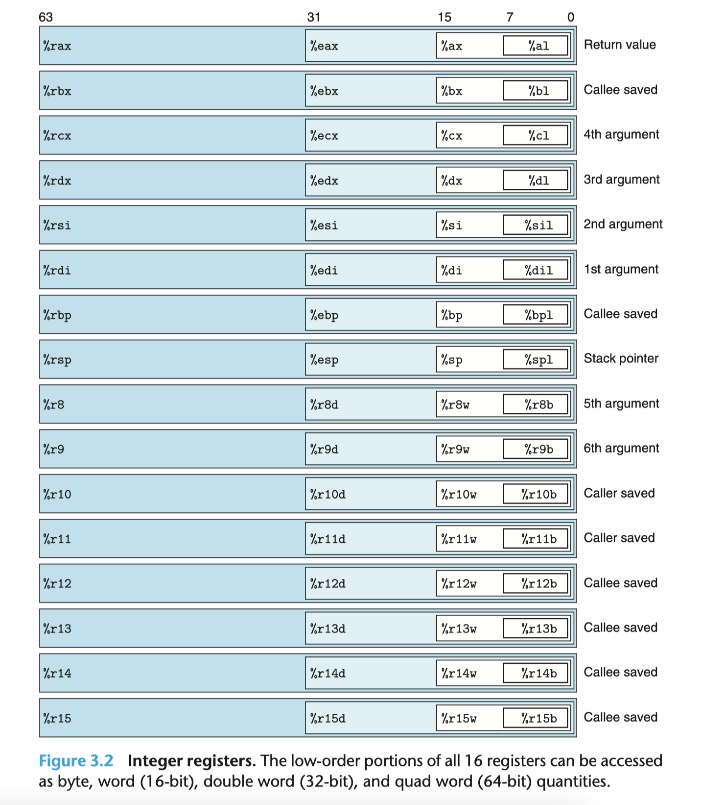
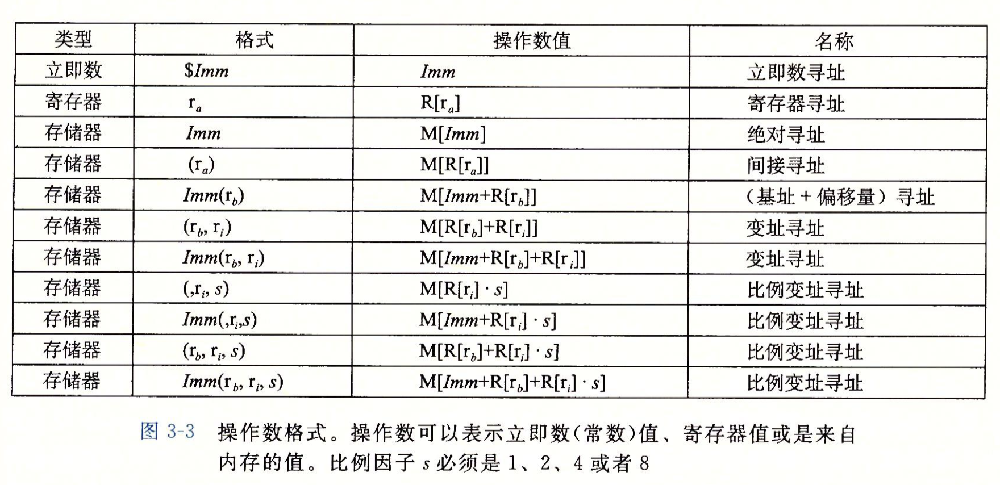
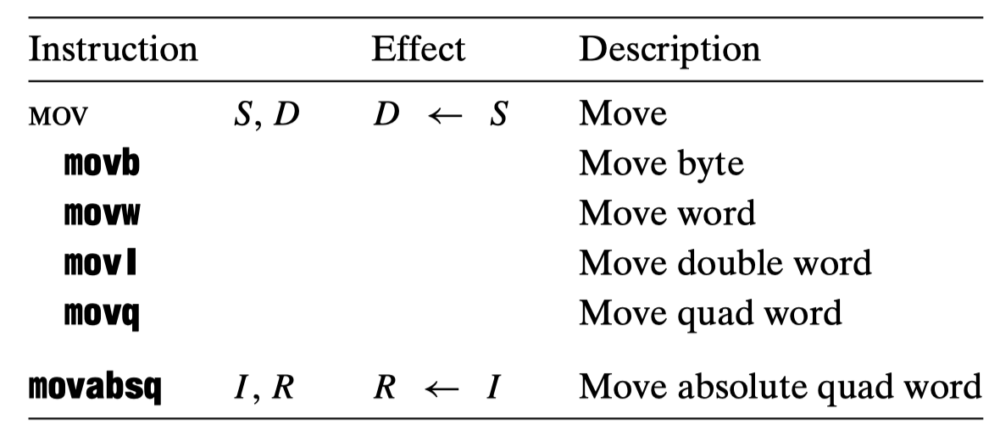
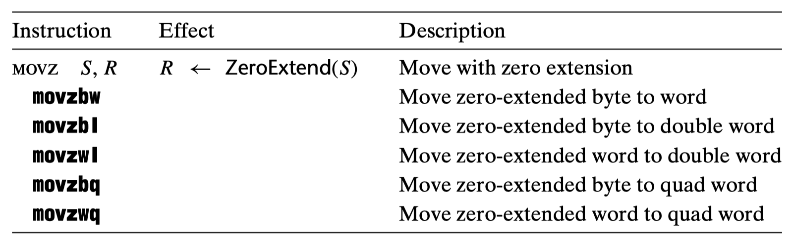
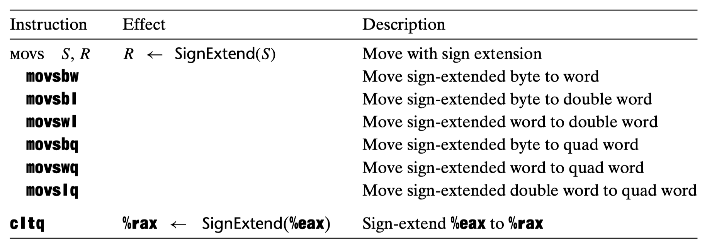
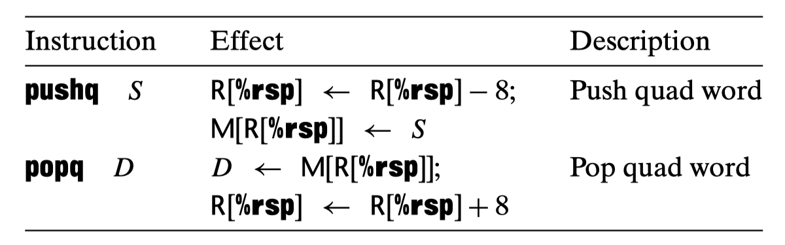
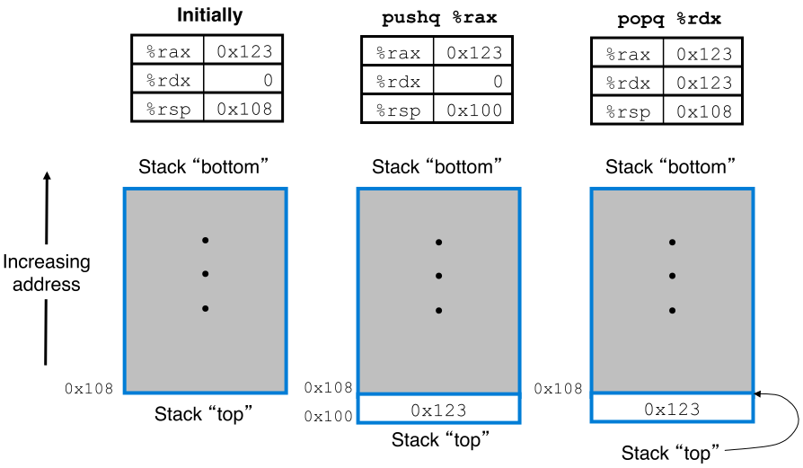

### 程序编码

```
linux> gcc -0g -o p p1.c p2.c
```

- gcc: GCC C 编译器（简写 cc）
- -0g: 编译选项，机器代码优化等级 (0: 符合原始 C 代码整体结构)

过程：

1. C 预处理器扩展源代码，插入#include 命令指定的文件，并扩展#define 声明指定的宏
2. 编译器产生两个汇编代码 p1.s 和 p2.s
3. 编译器将汇编代码转化成二进制目标文件 p1.0 和 p2.0（二进制形式）
4. 连接器将两目标代码文件与实现库函数（如 printf）合并，产生最终可执行代码文件 p

**机器级代码两层抽象**

- 指令集体系结构或指令集架构(Instruction Set Architecture, ISA)来定义机器级程序的格式和行为：将程序行为描述成每条指令都是顺序执行的。
- 机器级程序使用的内存地址是虚拟地址，也就是内存模型的抽象：内存模型看作一个非常大的字节数组。

**代码示例**

`-S`产生汇编代码文件：`mstore.s`

```
linux> gcc -0g -S mstore.c
```

`-c`编译并汇编代码，产生目标代码二进制文件`mstore.o`

```
linux> gcc -0g -c mstore.c
```

反汇编器(disassembler)程序：根据机器代码产生汇编代码格式（命令行参数`-d`，OBJDUMP 表示“object dump”）

```
linux> objdump -d mstore.o
```

**Intel 和 ATT 格式不同**

- Intel 代码省略了指示大小的后缀: `push`而不是`pushq`
- Intel 代码省略了寄存器名字前面的`%`符号: `rbx`而不是`%rbx`
- Intel 代描述内存位置的方式不同: `QWOED PTR [rbx]`而不是`(%rbx)`
- 带有多操作数的指令，操作数顺序相反

**C 程序和汇编代码结合**

使用条件：运算结果低 8 位中偶数个 1，奇偶标志(parity flag, PF)可以通过汇编快速获得。两种方法：

**第一种：** 编写完整函数，放进一个独立的汇编代码文件中，让汇编器和链接器把它和用 C 语言书写的代码合并起来。

**第二种** 可以使用 GCC 的内联汇编(inline assembly)特性，用 asm 伪指令在 C 中包含简短汇编代码。优点减少了机器相关的代码量。

## 数据和汇编

C 语言数据类型在 x86-64 中的大小，64 位机器，指针长为 8 字节

|   C 声明   | Intel 数据类型 | 汇编代码后缀 | 大小（字节） |
| :--------: | :------------: | :----------: | :----------: |
|    char    |      字节      |      b       |      1       |
|   short    |       字       |      w       |      2       |
|    int     |      双字      |    **l**     |      4       |
|    long    |      四字      |      q       |      8       |
| **char\*** |    **四字**    |    **q**     |    **8**     |
|   float    |     单精度     |      s       |      4       |
|   double   |     双精度     |    **l**     |      8       |

- 双字(double word)为 32 位，四字(quad word) 为 64 位
- 字节(`b`)、字(`w`)、双字(`l`)、四字(`q`)
- 后缀`l`表示 4 字节整数和 8 字节双精度浮点数，无歧义，浮点数用不同指令和寄存器

**通用目的寄存器**


发展过程

- 最初的 8086 架构 有 8 个 16 位寄存器，标号从`%ax`到`%sp`，其名字则反映功能
- 扩展到 IA32 架构，寄存器也扩展成 32 位寄存器，标号从`%eax`到`%esp`
- 扩展到 x86-64 后，原来 8 个寄存器扩展成 64 位，标号从`%rax`到`%rsp`，同时新增 8 个新寄存器，标号按照新命名规则，从`%r8`到`%r15`

寄存器使用优先级由低位到高位，**两条规则:** **(a)** 生成 1 字节和 2 字节数字的指令会保持剩下的字节不变 **(b)** 生成 4 字节数字指令会把高位 4 个字节置 0

- 程序计数器 PC `%rip`: 下条指令在内存中地址
- 栈指针`%rsp`: 运行时栈的结束位置

**操作数指示符**

三种操作数类型：立即数(Imm)、寄存器值(Reg)和内存值(Mem)



### 数据传输指令

**MOV 类** 把不同的指令划分成**指令类**，每一类指令执行相同操作，只不过操作数大小不同

**简单数据传输指令:** `movb`, `movw`, `movl`, `movq`和`movabsq`



- 源操作数指定的值是立即数，存储在寄存器或者内存中；目的操作数指定位置，寄存器或内存地址
- x86-64 限制：`mov`指令两个操作数**不能都指向内存**位置
  - 解决：用两条`mov`指令，第一条指令将源值加载到寄存器中，第二条将寄存器值写入目的位置
- 寄存器大小必须与指令标识符后缀**大小匹配**
- **`movl`指令以寄存器为目的时，会把该寄存器的高 4 字节设置为 0**
  - x86-64 惯例：任何为寄存器生成 32 位值的指令都会把该寄存器的高位部分置 0
- `movq`以 32 位补码数字的立即数做源操作数，然后将**值符号扩展**得到 64 位值，放到目的位置
- `movabsq`能够以**任意** 64 位立即数作为源操作数，并且只能以寄存器作目的

```x86asm
movabsq $0x0011223344556677, %rax   %rax = 0011223344556677
movb $-1, %al                       %rax = 00112233445566FF
movw $-1, %ax                       %rax = 001122334455FFFF
movl $-1, %eax                      %rax = 00000000FFFFFFFF
movq $-1, %rax                      %rax = FFFFFFFFFFFFFFFF
```

**零扩展数据传输指令** `movzbw`, `movzbl`, `movzwl`, `movzbq`和`movzwq`



- 把目的剩余字节填充 0
- 后缀第一个字符指定源大小，第二个指令目的大小，显然只考虑目的大于源的情况
- 少`movzlq`，因为`movl`会自动作 0 扩展

**符号扩展数据传输指令** `movsbw`, `movsbl`, `movswl`, `movsbq`, `movswq`, `movslq`和`cltq`



- 把目的剩余字节通过符号扩展来填充
- `cltq`(change long word to quad)与`movslq %eax, %rax`形式一样，编码更加紧凑

```x86asm
movabsq $0x0011223344556677, %rax   %rax = 0011223344556677
movb $0xAA, %dl                     %dl  = AA
movb %dl,%al                        %rax = 00112233445566AA
movsbq %dl,%rax                     %rax = FFFFFFFFFFFFFFAA
movzbq %dl,%rax                     %rax = 00000000000000AA
```

**练习题 3.3** 解释错误指令

```x86asm
movb $0xF, (%ebx)
movl %rax, (%rsp)
movw (%rax),4(%rsp)
movb %al,%sl
movq %rax,$0x123
movl %eax,%rdx
movb %si, 8(%rbp)
```

**⚠️ 练习题 3.4**

当执行强制类型转化既涉及大小变化又涉及 C 语言中符号变化时，操作应该先改变大小

```c
// sp in %rdi, dp in %rsi
src_t *sp;
dest_t *dp;

*dp = (dest_t) *sp; //指针间接引用(pointer dereferencing)
```

|     src_t     |    dest_t     |                    指令                    |
| :-----------: | :-----------: | :----------------------------------------: |
|     long      |     long      | `movq (%rdi), %rax`<br>`movq %rax, (%rsi)` |
|     char      |      in       |                    <br>                    |
|     char      |   unsigned    |                    <br>                    |
| unsigned char |     long      |                    <br>                    |
|      int      |     char      |                    <br>                    |
|   unsigned    | unsigned char |                    <br>                    |
|     char      |     short     |                    <br>                    |

**入栈出栈指令** `push`和`pop`




- 栈向下增长，栈顶元素的地址是所有栈中元素地址中最低的
- `pushq %rbp`指令等价
  - `subq $8,%rsp`<br>`movq %rbp,(%rsp) `
- `popq %rax`指令等价
  - `movq (%rsp),%rax`<br>`addq $8,%rsp`
- `pop`指令执行完，原栈顶值会被**保持**在内存位置，直到被覆盖
- `%rsp`总是指向栈顶，但栈中其他元素可以被访问

### 算术和逻辑操作


**加载有效地址(load effective address)**

- mov 指令变形，将**有效地址**写入到目的操作数，位后续内存引用产生指针
  - 类似 C 语言中 `&S`
- 也可以作简洁**算术操作**，用法灵活
  - `%rdx`值为 x<br>则`leaq 7(%rdx, %rdx, 4), %rax`<br>得到`%rax`值为 5x+7

**一元操作**

**二元操作**

**位移**
